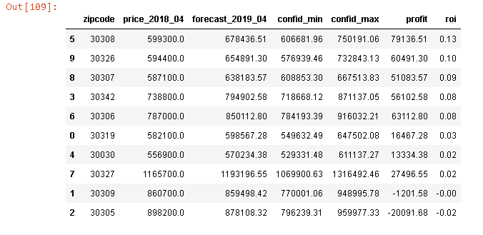

[Blog Post can be found here](https://medium.com/@cheffrey2000/mod-4-83589fcff956?sk=790f0417cbdb21df21c524280e1448b3)
    

[Presentation Slide Show](https://docs.google.com/presentation/d/1PxWlpmrsNDyx1Z6Z6jojopivQKqg9PoY58UcoAJFQmg/edit?usp=sharing)

[Video Presentation](https://youtu.be/i8cE3neEtSs)

## Goal
The goal of this research is to determine the best return on investment (ROI) when purchasing houses in the Atlanta Metropolitan area.  

---

## ROI - What it means to us
For the purpose of this analysis, we will define ROI as: Increase in value after a 2 year holding period.  We will use this timeframe due to the tax laws regarding capital gains.  After 2 years, capital gains taxes are no longer assessed.

## The Data
After looking at the average price per zip code in all of Georgia, we decided to narrow our analysis to the areas that grew the most after the Housing Bubble Pop in 2009.  This was determined by finding the lowest and highest average price in each zip and calculating the difference.  The areas with the largest difference which is the most gain, made it into our data for analysis.

Below is a graph of the best zip codes as calculated using the method described above.

After choosing our focus data, we ran a test model

Next we generated all of the possible parameter combinations for the models to determine the best parameters to use for our forecasting.

Choosing the parameters which gave us the lowest AIC, which measures the goodness of fit  
We then applied the parameters to our model and began our predictions.

## Findings
From our predictions we have determined that the zip codes that should produce the highest return on investment are  
- 30308
- 30326
- 30307
- 30342
- 30306  
These zip codes should provide a return on investment of between 8% and 13% after a two year holding period.  
